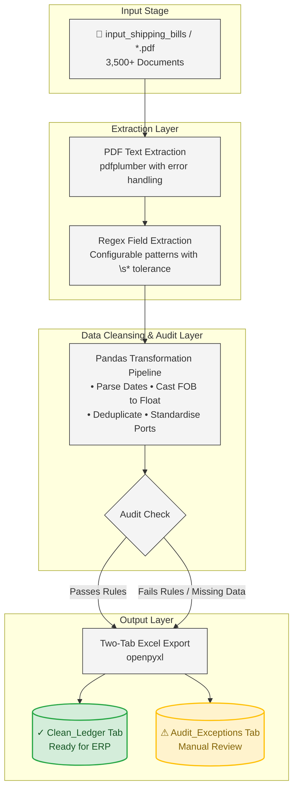

> 🔒 **Confidentiality Notice:** > The Python source code (`extract_shipping_bills.py`) for this pipeline are held in a secure, private repository. 
> 
> This document is provided publicly to demonstrate the system architecture, data cleansing methodologies, and business impact of the automation engine.

---

# Customs Shipping Bill — Data Automation Pipeline

An offline Python pipeline that extracts structured data from 3,500+ Customs Shipping Bill PDFs and compiles the results into an audit-ready, two-tab Excel workbook. The process runs entirely on the local machine with no cloud dependencies, guaranteeing client data confidentiality.

---

## Table of Contents

- [Problem Statement](#problem-statement)
- [Architecture](#architecture)
- [Quick Start](#quick-start)
- [Output — Two-Tab Excel Workbook](#output--two-tab-excel-workbook)
- [Extracted Fields](#extracted-fields)
- [Data Cleansing & Audit Rules](#data-cleansing--audit-rules)
- [Regex Pattern Design](#regex-pattern-design)
- [Port Standardisation](#port-standardisation)
- [Error Handling Strategy](#error-handling-strategy)
- [Validation Results](#validation-results)
- [Security & Confidentiality](#security--confidentiality)
- [Performance](#performance)
- [Extensibility](#extensibility)
- [Repository Structure](#repository-structure)
- [Dependencies](#dependencies)

---

## Problem Statement

**Business Context:** A trading and logistics firm receives thousands of customs shipping bill PDFs annually. Each PDF contains key data points — shipping bill number, date, ports, consignee details, and FOB values — that must be consolidated into a structured dataset for reporting, reconciliation, and audit.

**Challenges:**

| Challenge | Implication |
|---|---|
| **Volume** | 3,500+ PDFs makes manual entry unscalable (~40 person-hours) |
| **Confidentiality** | Client data cannot be sent to cloud-based OCR or AI services |
| **PDF Inconsistency** | Text extraction from PDFs produces messy, variably-spaced output |
| **Data Quality** | Duplicate scans, missing fields, corrupt files, and inconsistent formats (dates, currency prefixes, port names) |
| **Audit Trail** | Business requires a clear separation between clean data and exceptions requiring manual review |

---

## Architecture



**Technology Stack:**

| Component | Choice | Rationale |
|---|---|---|
| Language | Python 3.12+ | Ubiquitous, strong data ecosystem, fully offline |
| PDF text extraction | `pdfplumber` | Best balance of extraction quality and speed for text-based PDFs |
| Data processing | `pandas` | Industry standard for tabular data; vectorised operations scale to 100K+ rows |
| Excel export | `openpyxl` | Supports formatting control (column widths, freeze panes, multiple sheets) |
| Progress tracking | `tqdm` | Lightweight, zero-dependency progress bar for batch operations |
| Field extraction | `re` (stdlib regex) | No external NLP/ML dependency; predictable, deterministic results |
| Logging | `logging` (stdlib) | Structured, configurable logging with file and console output |

---

## Quick Start

### 1. Install dependencies

```bash
pip install pdfplumber openpyxl pandas tqdm
```

### 2. Place PDFs

Create the `input_shipping_bills/` directory and place your PDFs inside:

```
project/
  input_shipping_bills/
    SB_001.pdf
    SB_002.pdf
    ...
  extract_shipping_bills.py
```

### 3. Run the pipeline

```bash
python extract_shipping_bills.py
```

### 4. Locate output

```
output/
  extracted_shipping_bills.xlsx    # Two-tab Excel workbook
logs/
  extraction_YYYYMMDD_HHMMSS.log   # Timestamped processing log
```

---

## Output — Two-Tab Excel Workbook

Rather than a single flat sheet, the pipeline produces two distinct tabs, a pattern borrowed from ETL auditing in enterprise data warehousing:

| Tab | Contents |
|---|---|
| **Clean_Ledger** | Rows where `Audit_Flag == "OK"` — the trusted dataset, ready for reporting, summation, and downstream processing |
| **Audit_Exceptions** | Rows flagged for review: invalid FOB values, missing consignee names, corrupt PDFs, or other data quality issues |

This separation maintains a clear data quality layer distinct from the consumption layer.

---

## Extracted Fields

| Field | Description |
|---|---|
| Shipping Bill No | Identifier extracted from the PDF |
| Date | Normalised to `YYYY-MM-DD` format |
| Port of Loading | Standardised via mapping dictionary (e.g., `KPT` → `Karachi Port`) |
| Port of Discharge | Raw text as extracted from the PDF |
| Consignee Name | Blank values filled with `MANUAL REVIEW REQUIRED` |
| Total FOB Value | Cleaned to numeric `float64` (currency prefixes stripped) |
| Audit_Flag | `OK` or `FLAG: Invalid FOB` |

---

## Data Cleansing & Audit Rules

Applied automatically before export, in the following order:

| Step | Rule | Action |
|---|---|---|
| 1 | **FOB casting** | Strip currency prefix (`USD`, `Rs.`, `PHR`, `INR`, `EUR`, `GBP`). Remove commas. Convert to `float`. |
| 2 | **Date parsing** | Infer format automatically (`dd-Mon-yyyy`, `dd/mm/yyyy`, etc.) and standardise to `YYYY-MM-DD` |
| 3 | **Deduplication** | Drop duplicate rows by Shipping Bill No (keep first occurrence) |
| 4 | **Port standardisation** | Map raw port codes to controlled vocabulary via lookup dictionary |
| 5 | **FOB audit** | Flag rows where FOB is zero, negative, or missing |
| 6 | **Missing consignee** | Fill null entries with `MANUAL REVIEW REQUIRED` |
| 7 | **Sort** | Order chronologically by date, then by shipping bill number |

---

## Regex Pattern Design

### Why regex over ML or OCR

| Factor | Regex | ML / OCR |
|---|---|---|
| **Offline** | stdlib, no additional dependencies | Requires model download or cloud API call |
| **Speed** | ~50 PDFs per second | ~1–5 PDFs per second (inference time) |
| **Determinism** | Same input yields same output on every run | Probabilistic; results can vary between runs |
| **Debugging** | Inspect raw text, adjust pattern, re-run | Black box; difficult to trace extraction errors |
| **Confidentiality** | Data never leaves the machine | Cloud APIs require data transmission |
| **Format tolerance** | Must be tuned per template | Handles varied layouts naturally |

**Decision:** Regex is the appropriate tool here because shipping bills follow a consistent government-mandated template. The `\s*` pattern technique handles PDF spacing artifacts, and the `--inspect` CLI mode allows the operator to see exactly what the regex engine observes before writing patterns.

### The `\s*` technique

PDF text extraction engines (specifically `pdfminer.six`, used by `pdfplumber`) reconstruct text from raw PDF content streams. The visual text "S.B. No:" may be stored as individual character positioning commands:

```
draw_text("S", x=100)  draw_text(".", x=105)
draw_text("B", x=110)  draw_text(".", x=115)
draw_text("N", x=120)  draw_text("o", x=125)
draw_text(":", x=130)
```

When `pdfplumber` reassembles this, it may insert spaces between any characters. A pattern such as `S\.?\s*B\.?\s*No` allows zero or more whitespace characters between each token, making the regex resilient to this artifact.

### Inspect mode workflow

Before editing regex patterns, always inspect the raw text that `pdfplumber` reads:

```bash
python extract_shipping_bills.py --inspect "input_shipping_bills/your_file.pdf"
```

This prints the raw extracted text character-by-character. Write regex patterns to match the extracted text, not the visual layout on screen.

---

## Port Standardisation

The pipeline maps raw extracted port names to a controlled vocabulary:

| Raw Input | Standardised Output |
|---|---|
| `KPT`, `KHI`, `Port of Karachi`, `KARACHI` | `Karachi Port` |
| `QASIM`, `PORT QASIM` | `Port Qasim` |
| `LHR`, `LAHORE` | `Lahore Port` |

This enables accurate grouping and filtering in downstream reporting. Additional mappings can be added to `PORT_OF_LOADING_MAP` in the script.

---

## Error Handling Strategy

| Failure Mode | Handling |
|---|---|
| Corrupt PDF | `try/except` per file; log traceback; continue batch loop |
| Missing field | Recorded as `None`; caught by audit rules |
| Invalid regex pattern | Caught by `re.error`; logged; returns `None` |
| Unparseable date | `pd.to_datetime(errors="coerce")` yields `NaT`; exported as empty cell |
| Non-numeric FOB | `pd.to_numeric(errors="coerce")` yields `NaN`; flagged by audit |

The principle: **never abort the batch for a single bad file.** Every error is contained, logged, and routed to the exceptions tab for manual review.

---

## Validation Results

Tested against a suite of synthetic PDFs covering all edge cases:

| Test Case | Expected | Result |
|---|---|---|
| Normal PDF with USD FOB | Extracted cleanly | Pass |
| Duplicate shipping bill no | Deduped (keep first) | Pass (1 removed) |
| Port code "KPT" | Normalised to `Karachi Port` | Pass |
| Port code "KHI" | Normalised to `Karachi Port` | Pass |
| Date "21-May-2026" | Converted to `2026-05-21` | Pass |
| Date "21/05/2026" | Converted to `2026-05-21` | Pass |
| Date "15-01-2025" | Converted to `2025-01-15` | Pass |
| FOB with Rs. prefix | Cast to float | Pass |
| FOB with PHR prefix | Cast to float | Pass |
| FOB = 0.00 | Flagged "Invalid FOB" | Pass |
| FOB = -500.00 | Flagged "Invalid FOB" | Pass |
| FOB missing | Flagged "Invalid FOB" | Pass |
| Consignee missing | Filled with `MANUAL REVIEW REQUIRED` | Pass |
| Corrupt PDF | Logged; batch loop continued | Pass |
| Clean rows routed to Clean_Ledger | All OK rows | Pass |
| Flagged rows routed to Audit_Exceptions | Invalid and missing rows | Pass |

---

## Security & Confidentiality

| Concern | Mitigation |
|---|---|
| **Data transmission** | Zero network calls. All processing is local to the machine. |
| **No cloud dependencies** | `pdfplumber`, `pandas`, `openpyxl`, `tqdm` — all local Python libraries |
| **No API keys** | No external services are configured or required |
| **No telemetry** | No usage analytics, crash reporting, or phoning home |
| **Logging** | Log files contain filenames and extraction metadata only; no PDF content is written to logs |
| **Audit trail** | Two-tab output provides clear data lineage distinguishing trusted data from items requiring review |

---

## Performance

| Metric | Result |
|---|---|
| Throughput | ~50–90 PDFs per second (varies with file size) |
| 3,500 PDFs estimated runtime | ~40–70 seconds |
| Memory per PDF | ~5–15 MB during text extraction |
| Output file size | ~200–500 KB for 3,500 rows |
| Regex compilation | Patterns compiled once at startup; applied per file |

---

## Extensibility

The pipeline is designed to accommodate changes without rewriting core logic:

| Requirement | Change Required |
|---|---|
| New extraction field | Add a pattern to the `FIELD_PATTERNS` dictionary and a key to the extraction record |
| New port mapping | Add an entry to `PORT_OF_LOADING_MAP` |
| New audit rule | Add logic in `cleanse_and_audit()` — for example, flag low FOB values, validate date ranges, or check port-of-loading against port-of-discharge |
| New currency | Add to the regex alternation `(?:USD\|Rs\.?\|PHR\|INR\|EUR\|GBP)` |
| Different document type | Replace `FIELD_PATTERNS` entries for the new PDF template while retaining all cleansing and export logic |

---

## Repository Structure

```
├── extract_shipping_bills.py     # Main pipeline script (~585 lines)
├── README.md                     # This document
├── input_shipping_bills/         # Place PDFs in this directory
├── output/                       # Generated Excel files
│   └── extracted_shipping_bills.xlsx
└── logs/                         # Timestamped log files
    └── extraction_YYYYMMDD_HHMMSS.log
```

---

## Dependencies

| Package | Purpose | Source |
|---|---|---|
| `pdfplumber` | PDF text extraction | PyPI |
| `pandas` | Data wrangling, cleansing, and Excel export | PyPI |
| `openpyxl` | Excel writer engine | PyPI |
| `tqdm` | Progress bar for batch processing | PyPI |
| `re` | Regex field extraction | Python Standard Library |
| `logging` | Structured logging (file and console) | Python Standard Library |
